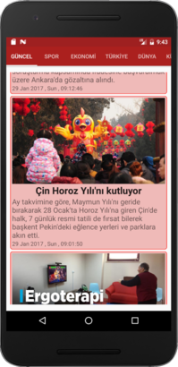
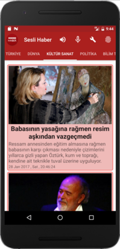
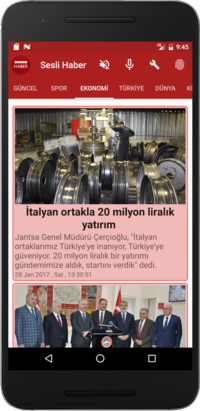
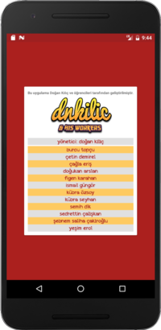

# Sesli Haber
# Bu uygulama 32 günde Android öğren programı kapsamında bir grup öğrenci tarafından geliştirilmiştir.

Özellikler
--------

Haberlerin kategorilere göre listelenmesi

Haber başlıklarının sentezlenmesi

Haber kategorileri arasında ses tanıma yapılarak geçiş yapılabilmesi

Belli radyo kanallarının çalınması

Ekran Görüntüleri
--------

      

Geliştiriciler
--------

FİGEN	KARAHAN	

<strike>Yönetici, yürütücü, şikayet dinleyici, gerekirse programmatic destek, yoğunlukla fikirsel destek, yanlışların ifade edilmesi, işlerin yürütülmesi, insiyatif kullanma, ben olmadan problemlerin çözülmesi, organizasyon. Proje bittiğinde kimin ismi yazılacak kiminki yazılmayacak karar mercii.</strike>

ÇAĞLA ERİŞ

<strike>yukarıdan aşağı çekme hareketi yapıldığında yeni haber var mı göstermesi</strike>

<strike>http://sapandiwakar.in/pull-to-refresh-for-android-recyclerview-or-any-other-vertically-scrolling-view/</strike>

<strike>https://www.bignerdranch.com/blog/implementing-swipe-to-refresh/</strike>

<strike>https://guides.codepath.com/android/Implementing-Pull-to-Refresh-Guide</strike>

BURCU	TOPÇU

<strike>hakkında ekranının tasarlanması - menu üzerinden hakkında ekranının açılabilmesi, hakkında ekranının içeriklerinin eklenmesi</strike>

<strike>https://developer.android.com/guide/topics/ui/menus.html</strike>

<strike>http://stackoverflow.com/questions/39546152/how-to-make-the-three-dots-appear-in-the-android-toolbar</strike>

<strike>https://github.com/dnkilic/android-gictionary</strike>

<strike>https://github.com/dnkilic/android-gictionary/tree/master/app/src/main/res (görsel içerik)</strike>

ELİF	KURT (listeye ismi eklenmeyecek)

<strike>uygulama içerisinde kullanılan renklerin değiştirilmesi
haberlerin pencere benzeri bir şey içerisine alınması,
bütün görsel düzenlemeler,
icon bulunması (yüksek çözünürlükte),
anadolu ajansı haricinde bir isim bulunması verilmesi,
yazı fontları vb'ni kapsayacak bütün görsel düzenlemeler.
farklı tasarımlar sınıfın onayına sunulmalı
Reklamların ayarlanması</strike>

<strike>https://material.io/guidelines/</strike>

<strike>https://developer.android.com/design/material/index.html</strike>

<strike>https://developer.android.com/distribute/monetize/ads.html</strike>

<strike>https://firebase.google.com/docs/admob/android/quick-start</strike>

ÇETİN	DEMİREL

<strike>picasso kütüphanesinin daha doğru kullanılması, resimlerin width bilgilerinin match_parent olması, resimler yüklenirken place holder gösterilmesi, resmin yüklenememisi durumunda hata resminin göstrerilmesi</strike>

<strike>http://square.github.io/picasso </strike>

HÜSAMETTİN	ERMİŞ (listeye ismi eklenmeyecek)

<strike>async task isteği gönderildikten datalar gelene kadarki zaman'da progress bar gösterilmesi</strike>

<strike>https://developer.android.com/reference/android/widget/ProgressBar.html</strike>

<strike>https://developer.android.com/reference/android/os/AsyncTask.html</strike>

SEMİH	DİK

<strike>Yukarı doğru swipe işlemi esnasında "anadolu ajansı" yazısısnın gizlenmesi, whatsapp'Daki gibi davranılması</strike>

<strike>https://mzgreen.github.io/2015/02/15/How-to-hideshow-Toolbar-when-list-is-scroling(part1)/</strike>

<strike>http://stackoverflow.com/questions/35967941/whatsapp-like-collapsing-toolbar</strike>

<strike>http://stackoverflow.com/questions/26539623/android-lollipop-toolbar-how-to-hide-show-the-toolbar-while-scrolling </strike>

NERGİS	ŞİMŞEK (listeye ismi eklenmeyecek)

Uygulamanın erişilebilir hale getirilmesi, talkback ile test edilmesi kör kullanıcılar için çalışır duruma getirilmesi

https://developer.android.com/guide/topics/ui/accessibility/index.html

https://developer.android.com/training/accessibility/index.html

SEDRETTİN	ÇALIŞKAN

<strike>Application bar'a ses tanıma işlemini tetikletecek bir tuş konulması, tıklanması durumunda ses inputu alınması ve kullanıcı spor derse spora ekonomi derse ekonomi kısmına yönlendirilmesi</strike>

<strike>https://developer.android.com/training/appbar/actions.html</strike>

<strike>https://developer.android.com/reference/android/speech/SpeechRecognizer.html</strike>

<strike>https://github.com/dnkilic/android-gerzek/tree/master/app/src/main/java/com/dnkilic/stupid/recognition</strike>

KÜBRA	ÖZSOY

<strike>Uygulama ilk yüklendiği zaman çıkacak kullanımın anlatıldığı bir tutorial ekranı veya tutorial ekranları tasarımı, next tuşları vs</strike>

<strike>https://developer.android.com/training/basics/data-storage/shared-preferences.html</strike>

<strike>https://github.com/riggaroo/MaterialIntroTutorial</strike>

DOĞUKAN	ARSLAN

<strike>Her haberin yanında bir text to speech butonu, kullanıcnın bu butona basması durumunda haberin description'ının okunması, butona tekrar basılırsa tts durur, başka ekrana geçerse tts durur, uygulama kapatılırsa tts durur</strike>

<strike>https://github.com/dnkilic/android-gerzek/tree/master/app/src/main/java/com/dnkilic/stupid/speaker</strike>

<strike>https://developer.android.com/training/material/lists-cards.html</strike>

KÜBRA SEYHAN

<strike>Tersine mühendisliği engellemek için proguard kurallarının oluşturulması, test edilmesi</strike>

<strike>https://developer.android.com/studio/build/shrink-code.html</strike>

<strike>https://www.mobilhanem.com/android-proguard-kullanimi-apk-guvenligi-apk-kucultme/</strike>

YEŞİM	EROL

<strike>Detay ekranının en üst tarafında meydana gelen görsel problemin çözülmesi</strike>

<strike>Uygulamanın farklı ekran boyutlarındaki cihazlarda test edilmesi, bug varsa raporlanması</strike>

<strike>https://developer.android.com/guide/topics/ui/themes.html</strike>

<strike>https://developer.android.com/guide/topics/resources/style-resource.html</strike>

İSMAİL	GÜNGÖR

<strike>internetin olmadığı durumlarda kullanıcının bilgilendirilmesi diyalog şeklinde recycle view içerisine geelecek şekilde, async task ile işlem yapılmaması</strike>

<strike>https://developer.android.com/training/basics/network-ops/connecting.html</strike>

<strike>https://github.com/dnkilic/android-gerzek/tree/master/app/src/main/java/com/dnkilic/stupid/view</strike>

ŞEBNEM SALİHA	ÇAKIROĞLU

<strike>Haber kategorilerine yeni bir ekran eklenmesi "Radyo" adının verilmesi ve bu ekranda haber radyoları çalınması</strike>
<strike>Radyolar recyle view'da listeleencek iconları vs güzel olacak.</strike>

<strike>"http://trtcanlifm-lh.akamaihd.net/i/RADYO1_1@182345/master.m3u8"</strike>

<strike>https://github.com/dnkilic/android-gerzek/tree/master/app/src/main/java/com/dnkilic/stupid/view</strike>

<strike>https://developer.android.com/reference/android/media/MediaPlayer.html</strike>

